This report covers the [2024 survey](https://redcap.vumc.org/community/post.php?id=232648)
from the Business Model Workgroup ([BMW](https://redcap.vumc.org/community/index.php?topic=200834)).
To reproduce this report, please see our
[repository](https://github.com/OuhscBbmc/redcap-business-model-survey-2024).


<!--  Set the working directory to the repository's base directory; this assumes the report is nested inside of two directories.-->


<!-- Set the report-wide options, and point to the external code file. -->


<!-- Load 'sourced' R files.  Suppress the output when loading sources. -->


<!-- Load packages, or at least verify they're available on the local machine.  Suppress the output when loading packages. -->


<!-- Load any global functions and variables declared in the R file.  Suppress the output. -->


<!-- Declare any global functions specific to a Rmd output.  Suppress the output. -->


<!-- Load the datasets.   -->


<!-- Tweak the datasets.   -->


Summary {.tabset .tabset-fade .tabset-pills}
===========================================================================

Notes
---------------------------------------------------------------------------

1.  The current report covers 82 survey responses to the institutional survey.
1.  Other information is available at:
<https://redcap.link/bmw_institutiondata>

Unanswered Questions
---------------------------------------------------------------------------

1. What does `VS` stand for?  How was it measured?
1. Where the cars at the Philly track measured with the same phluguerstometer and the Cleveland track?


Answered Questions
---------------------------------------------------------------------------


Marginals
===========================================================================

Institution 1 Instrument
---------------------------------------------------------------------------

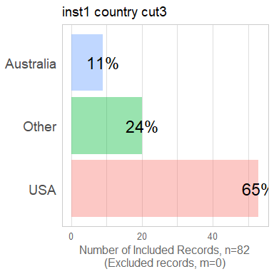<!-- -->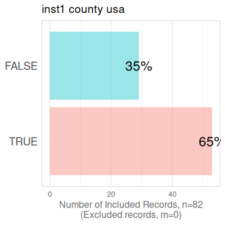<!-- -->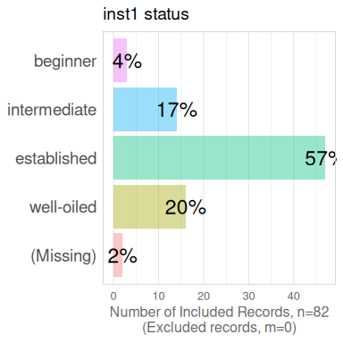<!-- -->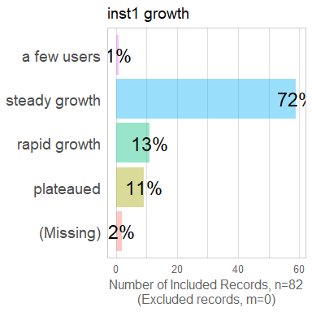<!-- -->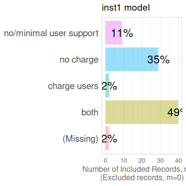<!-- -->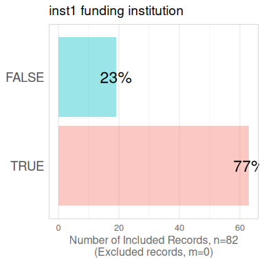<!-- --><!-- -->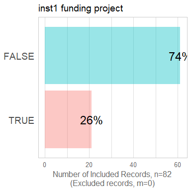<!-- -->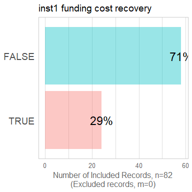<!-- -->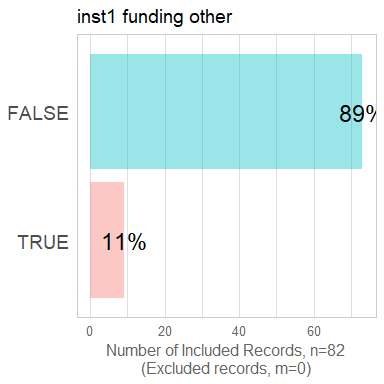<!-- -->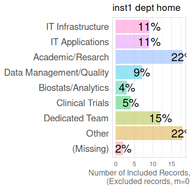<!-- -->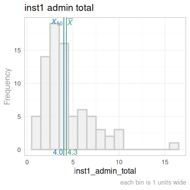<!-- -->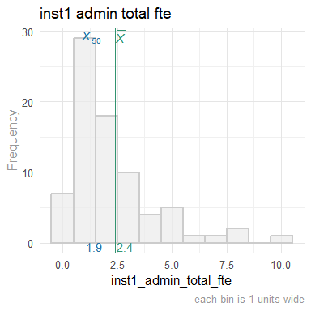<!-- -->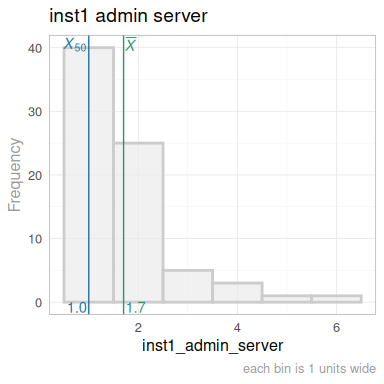<!-- -->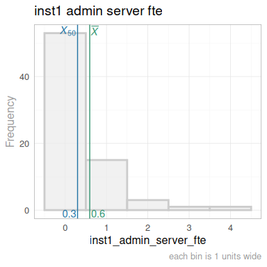<!-- -->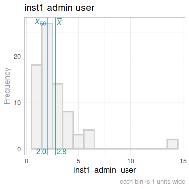<!-- -->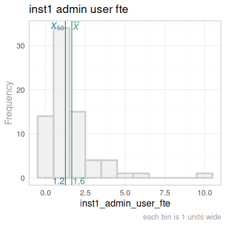<!-- -->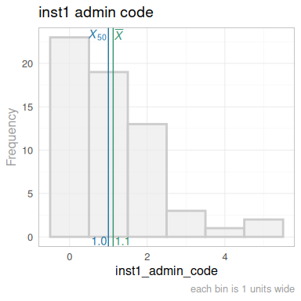<!-- -->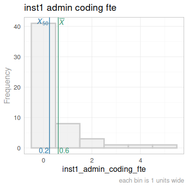<!-- -->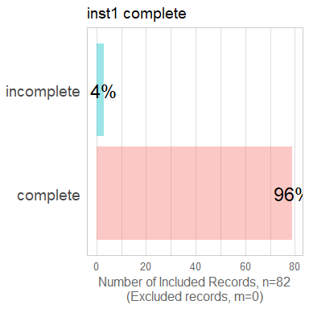<!-- -->


Scatterplots
===========================================================================


Correlation Matrixes
===========================================================================


Models
===========================================================================

Model Exploration
---------------------------------------------------------------------------


Final Model
---------------------------------------------------------------------------


Session Information {#session-info}
===========================================================================

For the sake of documentation and reproducibility, the current report was rendered in the following environment.  Click the line below to expand.

<details>
  <summary>Environment <span class="glyphicon glyphicon-plus-sign"></span></summary>

```
─ Session info ───────────────────────────────────────────────────────────────
 setting  value
 version  R version 4.4.1 (2024-06-14)
 os       Ubuntu 24.04.1 LTS
 system   x86_64, linux-gnu
 ui       X11
 language (EN)
 collate  en_US.UTF-8
 ctype    en_US.UTF-8
 tz       America/Chicago
 date     2024-09-15
 pandoc   3.1.11 @ /usr/lib/rstudio/resources/app/bin/quarto/bin/tools/x86_64/ (via rmarkdown)

─ Packages ───────────────────────────────────────────────────────────────────
 package         * version  date (UTC) lib source
 arrow             17.0.0.1 2024-08-21 [1] CRAN (R 4.4.1)
 assertthat        0.2.1    2019-03-21 [1] CRAN (R 4.4.0)
 base            * 4.4.1    2024-06-17 [4] local
 bit               4.0.5    2022-11-15 [1] CRAN (R 4.4.0)
 bit64             4.0.5    2020-08-30 [1] CRAN (R 4.4.0)
 bslib             0.8.0    2024-07-29 [1] CRAN (R 4.4.1)
 cachem            1.1.0    2024-05-16 [1] CRAN (R 4.4.0)
 cli               3.6.3    2024-06-21 [1] CRAN (R 4.4.1)
 colorspace        2.1-1    2024-07-26 [1] CRAN (R 4.4.1)
 compiler          4.4.1    2024-06-17 [4] local
 config            0.3.2    2023-08-30 [1] CRAN (R 4.4.0)
 datasets        * 4.4.1    2024-06-17 [4] local
 digest            0.6.37   2024-08-19 [1] CRAN (R 4.4.1)
 dplyr             1.1.4    2023-11-17 [1] CRAN (R 4.4.0)
 evaluate          0.24.0   2024-06-10 [1] CRAN (R 4.4.1)
 fansi             1.0.6    2023-12-08 [1] CRAN (R 4.4.0)
 farver            2.1.2    2024-05-13 [1] CRAN (R 4.4.0)
 fastmap           1.2.0    2024-05-15 [1] CRAN (R 4.4.0)
 forcats           1.0.0    2023-01-29 [1] CRAN (R 4.4.0)
 generics          0.1.3    2022-07-05 [1] CRAN (R 4.4.0)
 ggplot2         * 3.5.1    2024-04-23 [1] CRAN (R 4.4.0)
 glue              1.7.0    2024-01-09 [1] CRAN (R 4.4.0)
 graphics        * 4.4.1    2024-06-17 [4] local
 grDevices       * 4.4.1    2024-06-17 [4] local
 grid              4.4.1    2024-06-17 [4] local
 gtable            0.3.5    2024-04-22 [1] CRAN (R 4.4.0)
 highr             0.11     2024-05-26 [1] CRAN (R 4.4.0)
 htmltools         0.5.8.1  2024-04-04 [1] CRAN (R 4.4.0)
 jquerylib         0.1.4    2021-04-26 [1] CRAN (R 4.4.0)
 jsonlite          1.8.8    2023-12-04 [1] CRAN (R 4.4.0)
 knitr           * 1.48     2024-07-07 [1] CRAN (R 4.4.1)
 labeling          0.4.3    2023-08-29 [1] CRAN (R 4.4.0)
 lifecycle         1.0.4    2023-11-07 [1] CRAN (R 4.4.0)
 magrittr          2.0.3    2022-03-30 [1] CRAN (R 4.4.0)
 methods         * 4.4.1    2024-06-17 [4] local
 munsell           0.5.1    2024-04-01 [1] CRAN (R 4.4.0)
 pillar            1.9.0    2023-03-22 [1] CRAN (R 4.4.0)
 pkgconfig         2.0.3    2019-09-22 [1] CRAN (R 4.4.0)
 purrr             1.0.2    2023-08-10 [1] CRAN (R 4.4.0)
 R6                2.5.1    2021-08-19 [1] CRAN (R 4.4.0)
 rlang             1.1.4    2024-06-04 [1] CRAN (R 4.4.0)
 rmarkdown         2.28     2024-08-17 [1] CRAN (R 4.4.1)
 rstudioapi        0.16.0   2024-03-24 [1] CRAN (R 4.4.0)
 sass              0.4.9    2024-03-15 [1] CRAN (R 4.4.0)
 scales            1.3.0    2023-11-28 [1] CRAN (R 4.4.0)
 sessioninfo       1.2.2    2021-12-06 [1] CRAN (R 4.4.0)
 stats           * 4.4.1    2024-06-17 [4] local
 TabularManifest   0.2.1    2024-06-03 [1] Github (Melinae/TabularManifest@2cfe1c1)
 tibble            3.2.1    2023-03-20 [1] CRAN (R 4.4.0)
 tidyselect        1.2.1    2024-03-11 [1] CRAN (R 4.4.0)
 tools             4.4.1    2024-06-17 [4] local
 utf8              1.2.4    2023-10-22 [1] CRAN (R 4.4.0)
 utils           * 4.4.1    2024-06-17 [4] local
 vctrs             0.6.5    2023-12-01 [1] CRAN (R 4.4.0)
 withr             3.0.1    2024-07-31 [1] CRAN (R 4.4.1)
 xfun              0.47     2024-08-17 [1] CRAN (R 4.4.1)
 yaml              2.3.10   2024-07-26 [1] CRAN (R 4.4.1)

 [1] /home/wibeasley/R/x86_64-pc-linux-gnu-library/4.4
 [2] /usr/local/lib/R/site-library
 [3] /usr/lib/R/site-library
 [4] /usr/lib/R/library

──────────────────────────────────────────────────────────────────────────────
```
</details>


Report rendered by wibeasley at 2024-09-15, 13:57 -0500 in 5 seconds.
