This report covers the [2024 survey](https://redcap.vumc.org/community/post.php?id=232648)
from the Business Model Workgroup ([BMW](https://redcap.vumc.org/community/index.php?topic=200834)).
To reproduce this report, please see our
[repository](https://github.com/OuhscBbmc/redcap-business-model-survey-2024).


<!--  Set the working directory to the repository's base directory; this assumes the report is nested inside of two directories.-->


<!-- Set the report-wide options, and point to the external code file. -->


<!-- Load 'sourced' R files.  Suppress the output when loading sources. -->


<!-- Load packages, or at least verify they're available on the local machine.  Suppress the output when loading packages. -->


<!-- Load any global functions and variables declared in the R file.  Suppress the output. -->


<!-- Declare any global functions specific to a Rmd output.  Suppress the output. -->


<!-- Load the datasets.   -->


<!-- Tweak the datasets.   -->


Summary {.tabset .tabset-fade .tabset-pills}
===========================================================================

Notes
---------------------------------------------------------------------------

1.  The current report covers 82 survey responses to the institutional survey.
1.  Other survey information is available at:
<https://redcap.link/bmw_institutiondata>

Unanswered Questions
---------------------------------------------------------------------------

1. Please see the full list at <https://github.com/OuhscBbmc/redcap-business-model-survey-2024/blob/main/documentation/notes-ingestion.md>
1. What does `VS` stand for?  How was it measured?
1. Where the cars at the Philly track measured with the same phluguerstometer and the Cleveland track?


Answered Questions
---------------------------------------------------------------------------


Marginals
===========================================================================

Institution 1 (Instrument)
---------------------------------------------------------------------------

<!-- --><!-- -->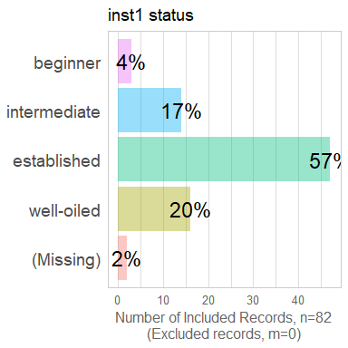<!-- --><!-- -->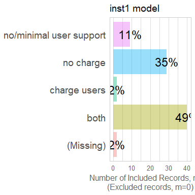<!-- -->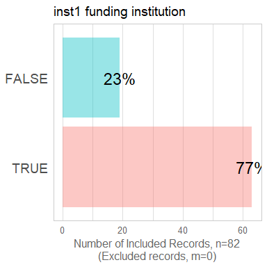<!-- -->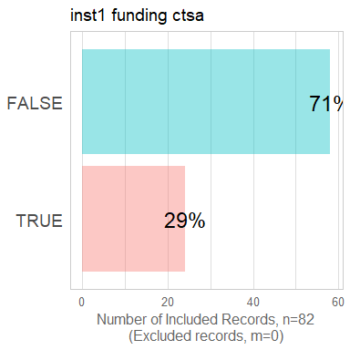<!-- --><!-- --><!-- --><!-- -->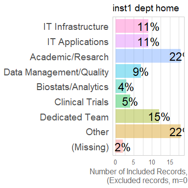<!-- -->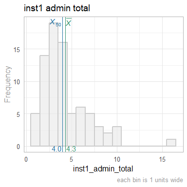<!-- --><!-- -->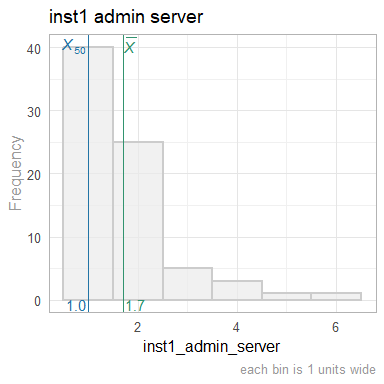<!-- -->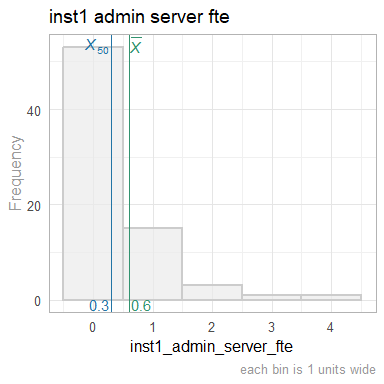<!-- -->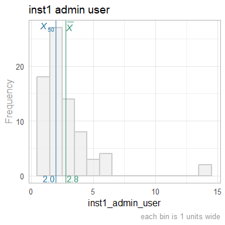<!-- -->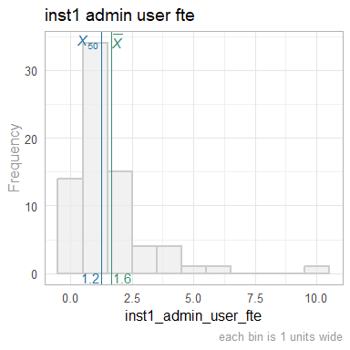<!-- -->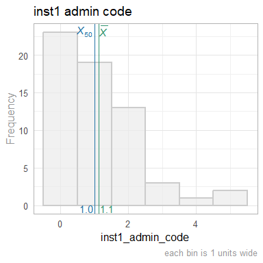<!-- -->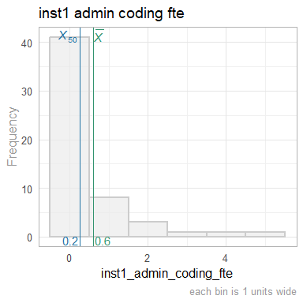<!-- --><!-- -->

Institution 2 (Instrument)
---------------------------------------------------------------------------

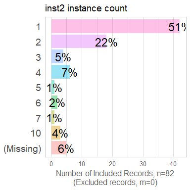<!-- -->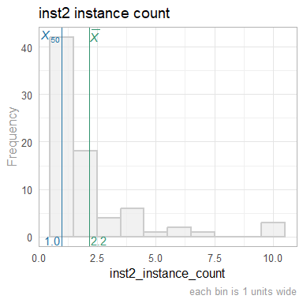<!-- -->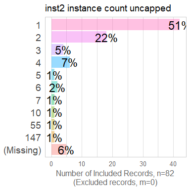<!-- -->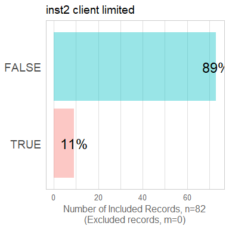<!-- -->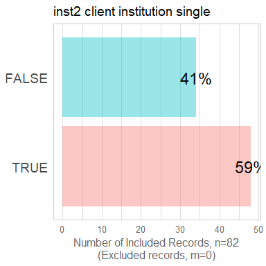<!-- -->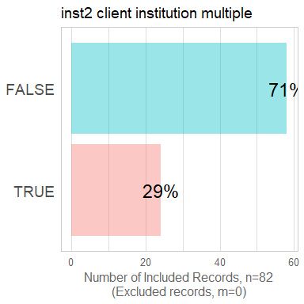<!-- -->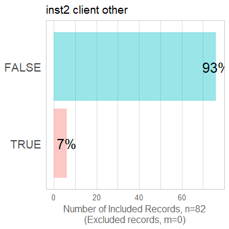<!-- -->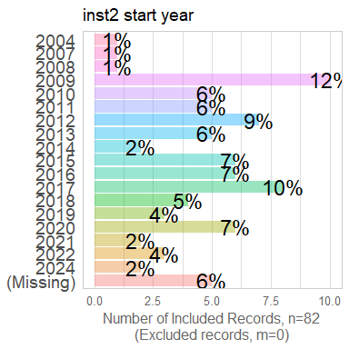<!-- -->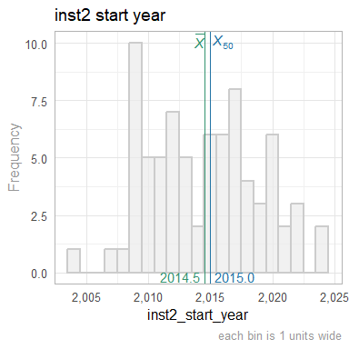<!-- -->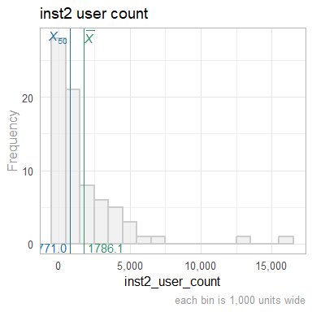<!-- -->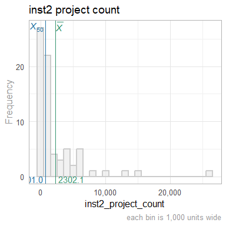<!-- -->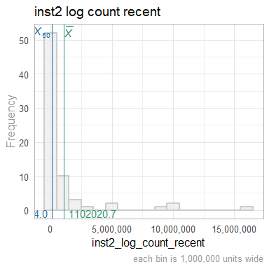<!-- -->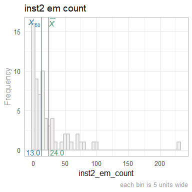<!-- -->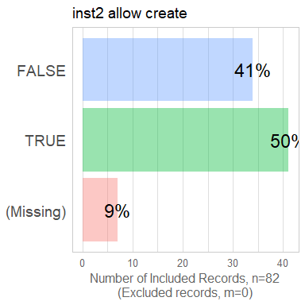<!-- -->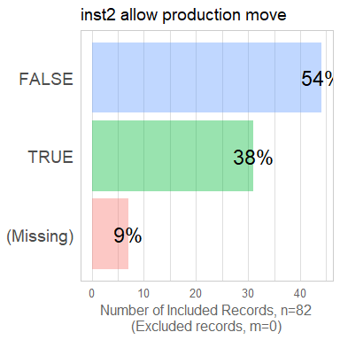<!-- -->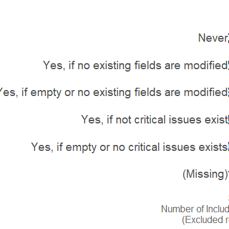<!-- -->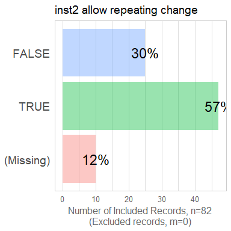<!-- -->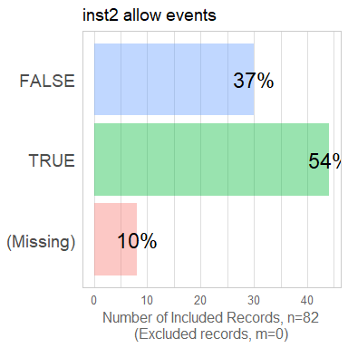<!-- -->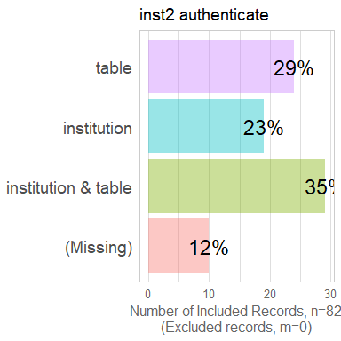<!-- -->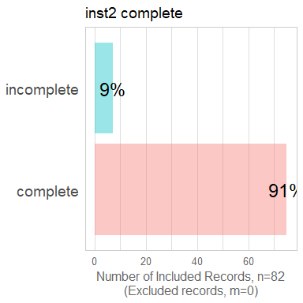<!-- -->

Institution 3 (Instrument)
---------------------------------------------------------------------------

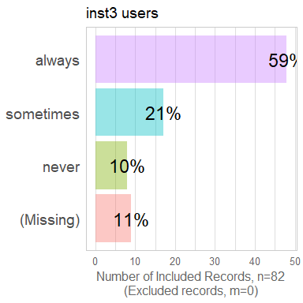<!-- -->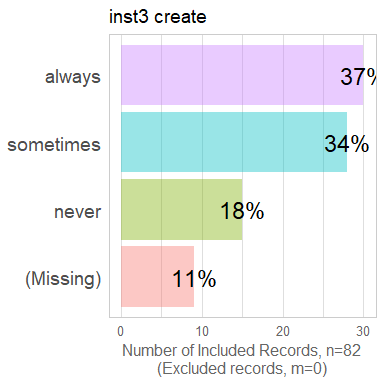<!-- -->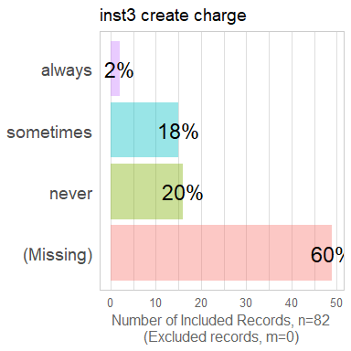<!-- -->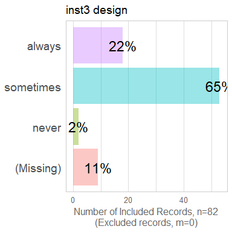<!-- -->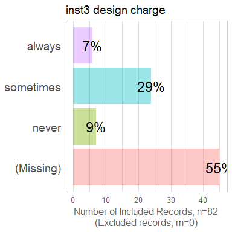<!-- -->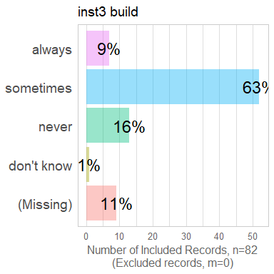<!-- -->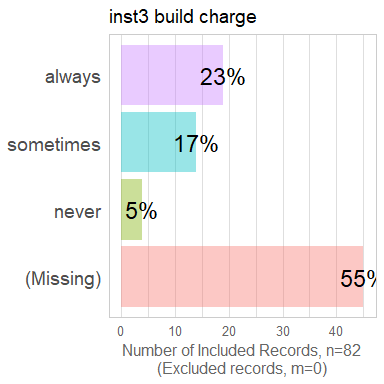<!-- -->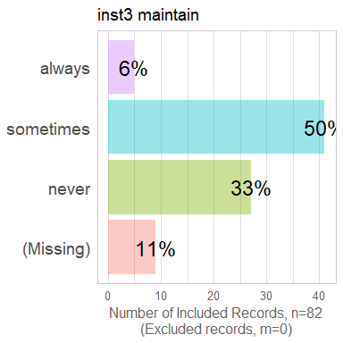<!-- -->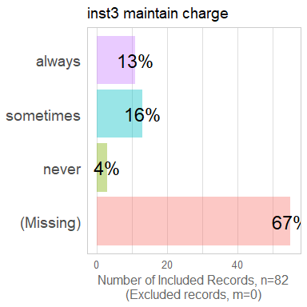<!-- -->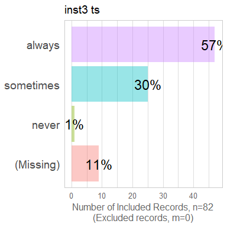<!-- -->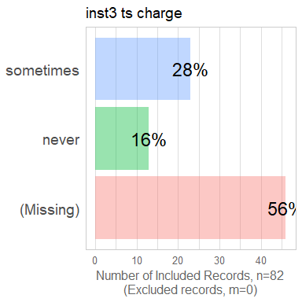<!-- -->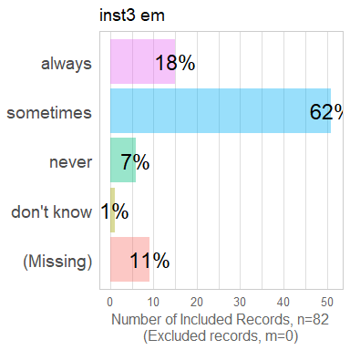<!-- -->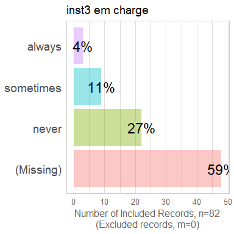<!-- -->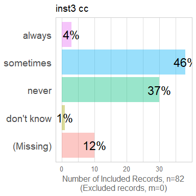<!-- -->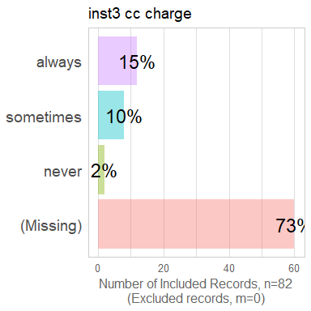<!-- -->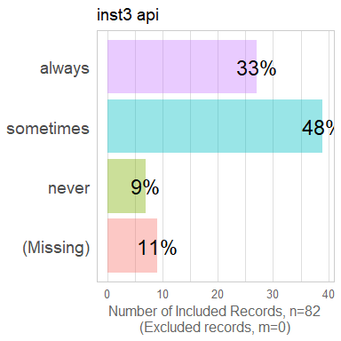<!-- -->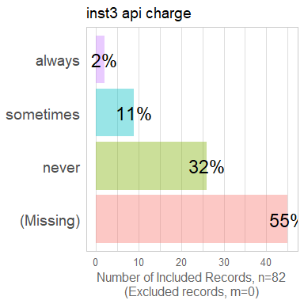<!-- -->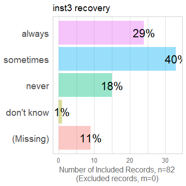<!-- --><!-- --><!-- --><!-- --><!-- --><!-- --><!-- --><!-- --><!-- --><!-- --><!-- --><!-- --><!-- --><!-- --><!-- --><!-- --><!-- --><!-- --><!-- --><!-- --><!-- --><!-- --><!-- --><!-- --><!-- -->


Scatterplots
===========================================================================


```
Warning: Removed 10 rows containing non-finite outside the scale range
(`stat_smooth()`).
```

```
Warning: Removed 10 rows containing missing values or values outside the scale range
(`geom_point()`).
```

<!-- -->

```
Warning: Removed 10 rows containing non-finite outside the scale range
(`stat_smooth()`).
```

```
Warning in simpleLoess(y, x, w, span, degree = degree, parametric = parametric,
: span too small.  fewer data values than degrees of freedom.
```

```
Warning: Removed 13 rows containing missing values or values outside the scale range
(`geom_point()`).
```

<!-- -->

```
Warning: Removed 8 rows containing non-finite outside the scale range
(`stat_smooth()`).
```

```
Warning: Removed 8 rows containing missing values or values outside the scale range
(`geom_point()`).
```

<!-- -->

```
Warning: Removed 7 rows containing non-finite outside the scale range
(`stat_smooth()`).
```

```
Warning: Removed 7 rows containing missing values or values outside the scale range
(`geom_point()`).
```

<!-- -->

```
Warning: Removed 11 rows containing non-finite outside the scale range
(`stat_smooth()`).
```

```
Warning: Removed 11 rows containing missing values or values outside the scale range
(`geom_point()`).
```

<!-- -->

```
Warning in scale_y_log10(breaks = scales::trans_breaks("log10", function(x)
10^x), : log-10 transformation introduced infinite values.
```

```
Warning in scale_y_log10(breaks = scales::trans_breaks("log10", function(x)
10^x), : log-10 transformation introduced infinite values.
```

```
Warning: Removed 23 rows containing non-finite outside the scale range
(`stat_smooth()`).
```

```
Warning: Removed 16 rows containing missing values or values outside the scale range
(`geom_point()`).
```

<!-- -->


Correlation Matrixes
===========================================================================


Models
===========================================================================

Model Exploration
---------------------------------------------------------------------------


Final Model
---------------------------------------------------------------------------


Session Information {#session-info}
===========================================================================

For the sake of documentation and reproducibility, the current report was rendered in the following environment.  Click the line below to expand.

<details>
  <summary>Environment <span class="glyphicon glyphicon-plus-sign"></span></summary>

```
─ Session info ───────────────────────────────────────────────────────────────
 setting  value
 version  R version 4.4.1 (2024-06-14)
 os       Ubuntu 24.04.1 LTS
 system   x86_64, linux-gnu
 ui       RStudio
 language (EN)
 collate  en_US.UTF-8
 ctype    en_US.UTF-8
 tz       America/Chicago
 date     2024-09-16
 rstudio  2024.04.2+764 Chocolate Cosmos (desktop)
 pandoc   3.1.11 @ /usr/lib/rstudio/resources/app/bin/quarto/bin/tools/x86_64/ (via rmarkdown)

─ Packages ───────────────────────────────────────────────────────────────────
 package         * version    date (UTC) lib source
 archive           1.1.9      2024-09-12 [1] CRAN (R 4.4.1)
 arrow             17.0.0.1   2024-08-21 [1] CRAN (R 4.4.1)
 assertthat        0.2.1      2019-03-21 [1] CRAN (R 4.4.0)
 backports         1.5.0      2024-05-23 [1] CRAN (R 4.4.0)
 base            * 4.4.1      2024-06-17 [4] local
 bit               4.0.5      2022-11-15 [1] CRAN (R 4.4.0)
 bit64             4.0.5      2020-08-30 [1] CRAN (R 4.4.0)
 bslib             0.8.0      2024-07-29 [1] CRAN (R 4.4.1)
 cachem            1.1.0      2024-05-16 [1] CRAN (R 4.4.0)
 checkmate         2.3.2      2024-07-29 [1] CRAN (R 4.4.1)
 cli               3.6.3      2024-06-21 [1] CRAN (R 4.4.1)
 colorspace        2.1-1      2024-07-26 [1] CRAN (R 4.4.1)
 compiler          4.4.1      2024-06-17 [4] local
 config            0.3.2      2023-08-30 [1] CRAN (R 4.4.0)
 crayon            1.5.3      2024-06-20 [1] CRAN (R 4.4.1)
 datasets        * 4.4.1      2024-06-17 [4] local
 digest            0.6.37     2024-08-19 [1] CRAN (R 4.4.1)
 dplyr             1.1.4      2023-11-17 [1] CRAN (R 4.4.0)
 evaluate          0.24.0     2024-06-10 [1] CRAN (R 4.4.1)
 fansi             1.0.6      2023-12-08 [1] CRAN (R 4.4.0)
 farver            2.1.2      2024-05-13 [1] CRAN (R 4.4.0)
 fastmap           1.2.0      2024-05-15 [1] CRAN (R 4.4.0)
 forcats           1.0.0      2023-01-29 [1] CRAN (R 4.4.0)
 generics          0.1.3      2022-07-05 [1] CRAN (R 4.4.0)
 ggplot2         * 3.5.1      2024-04-23 [1] CRAN (R 4.4.0)
 glue              1.7.0      2024-01-09 [1] CRAN (R 4.4.0)
 graphics        * 4.4.1      2024-06-17 [4] local
 grDevices       * 4.4.1      2024-06-17 [4] local
 grid              4.4.1      2024-06-17 [4] local
 gtable            0.3.5      2024-04-22 [1] CRAN (R 4.4.0)
 highr             0.11       2024-05-26 [1] CRAN (R 4.4.0)
 hms               1.1.3      2023-03-21 [1] CRAN (R 4.4.0)
 htmltools         0.5.8.1    2024-04-04 [1] CRAN (R 4.4.0)
 jquerylib         0.1.4      2021-04-26 [1] CRAN (R 4.4.0)
 jsonlite          1.8.8      2023-12-04 [1] CRAN (R 4.4.0)
 knitr           * 1.48       2024-07-07 [1] CRAN (R 4.4.1)
 labeling          0.4.3      2023-08-29 [1] CRAN (R 4.4.0)
 lattice           0.22-6     2024-03-20 [1] CRAN (R 4.4.0)
 lifecycle         1.0.4      2023-11-07 [1] CRAN (R 4.4.0)
 lubridate         1.9.3      2023-09-27 [1] CRAN (R 4.4.0)
 magrittr          2.0.3      2022-03-30 [1] CRAN (R 4.4.0)
 Matrix            1.7-0      2024-04-26 [4] CRAN (R 4.4.0)
 methods         * 4.4.1      2024-06-17 [4] local
 mgcv              1.9-1      2023-12-21 [1] CRAN (R 4.4.0)
 munsell           0.5.1      2024-04-01 [1] CRAN (R 4.4.0)
 nlme              3.1-165    2024-06-06 [4] CRAN (R 4.4.0)
 OuhscMunge        1.0.0.9000 2024-06-03 [1] Github (OuhscBbmc/OuhscMunge@bb2b989)
 parallel          4.4.1      2024-06-17 [4] local
 pillar            1.9.0      2023-03-22 [1] CRAN (R 4.4.0)
 pkgconfig         2.0.3      2019-09-22 [1] CRAN (R 4.4.0)
 png               0.1-8      2022-11-29 [1] CRAN (R 4.4.0)
 purrr             1.0.2      2023-08-10 [1] CRAN (R 4.4.0)
 R6                2.5.1      2021-08-19 [1] CRAN (R 4.4.0)
 RColorBrewer      1.1-3      2022-04-03 [1] CRAN (R 4.4.0)
 Rcpp              1.0.13     2024-07-17 [1] CRAN (R 4.4.1)
 readr             2.1.5      2024-01-10 [1] CRAN (R 4.4.0)
 REDCapR           1.2.0      2024-09-09 [1] CRAN (R 4.4.1)
 rematch2          2.1.2      2020-05-01 [1] CRAN (R 4.4.0)
 reticulate        1.39.0     2024-09-05 [1] CRAN (R 4.4.1)
 rlang             1.1.4      2024-06-04 [1] CRAN (R 4.4.0)
 rmarkdown         2.28       2024-08-17 [1] CRAN (R 4.4.1)
 rstudioapi        0.16.0     2024-03-24 [1] CRAN (R 4.4.0)
 sass              0.4.9      2024-03-15 [1] CRAN (R 4.4.0)
 scales            1.3.0      2023-11-28 [1] CRAN (R 4.4.0)
 sessioninfo       1.2.2      2021-12-06 [1] CRAN (R 4.4.0)
 splines           4.4.1      2024-06-17 [4] local
 stats           * 4.4.1      2024-06-17 [4] local
 stringi           1.8.4      2024-05-06 [1] CRAN (R 4.4.0)
 stringr           1.5.1      2023-11-14 [1] CRAN (R 4.4.0)
 TabularManifest   0.2.1      2024-06-03 [1] Github (Melinae/TabularManifest@2cfe1c1)
 tibble            3.2.1      2023-03-20 [1] CRAN (R 4.4.0)
 tidyr             1.3.1      2024-01-24 [1] CRAN (R 4.4.0)
 tidyselect        1.2.1      2024-03-11 [1] CRAN (R 4.4.0)
 timechange        0.3.0      2024-01-18 [1] CRAN (R 4.4.0)
 tools             4.4.1      2024-06-17 [4] local
 tzdb              0.4.0      2023-05-12 [1] CRAN (R 4.4.0)
 utf8              1.2.4      2023-10-22 [1] CRAN (R 4.4.0)
 utils           * 4.4.1      2024-06-17 [4] local
 vctrs             0.6.5      2023-12-01 [1] CRAN (R 4.4.0)
 vroom             1.6.5      2023-12-05 [1] CRAN (R 4.4.0)
 withr             3.0.1      2024-07-31 [1] CRAN (R 4.4.1)
 xfun              0.47       2024-08-17 [1] CRAN (R 4.4.1)
 yaml              2.3.10     2024-07-26 [1] CRAN (R 4.4.1)

 [1] /home/wibeasley/R/x86_64-pc-linux-gnu-library/4.4
 [2] /usr/local/lib/R/site-library
 [3] /usr/lib/R/site-library
 [4] /usr/lib/R/library

──────────────────────────────────────────────────────────────────────────────
```
</details>


Report rendered by wibeasley at 2024-09-16, 23:44 -0500 in 21 seconds.
